# MCP Gateway Deployment Modes

This guide describes the three deployment modes available for MCP Gateway Registry on AWS ECS.

## Deployment Mode Decision Matrix

| Scenario | Recommended Mode | `enable_cloudfront` | `enable_route53_dns` |
|----------|------------------|---------------------|----------------------|
| Custom domain with Route53/ACM | Custom Domain | `false` | `true` |
| HTTPS without custom domain | CloudFront | `true` | `false` |
| Local development/testing | Development | `false` | `false` |
| Both access paths needed | Dual Ingress | `true` | `true` |

## Terraform Output: `deployment_mode`

The `deployment_mode` output indicates the active configuration:

| Mode | `enable_cloudfront` | `enable_route53_dns` | Output Value |
|------|---------------------|----------------------|--------------|
| CloudFront | `true` | `false` | `cloudfront` |
| Custom Domain | `false` | `true` | `custom-domain` |
| Dual Ingress | `true` | `true` | `custom-domain` |
| Development | `false` | `false` | `development` |

> **Note:** Dual Ingress reports as `custom-domain` since Route53 DNS is the primary access path.

## Architecture Overview

```mermaid
flowchart TB
    subgraph "Custom Domain Mode"
        U1[Users] -->|HTTPS| R53[Route53 DNS]
        R53 --> ACM1[ACM Certificate]
        ACM1 --> ALB1[ALB with HTTPS]
        ALB1 --> ECS1[ECS Services]
    end

    subgraph "CloudFront Mode"
        U2[Users] -->|HTTPS| CF[CloudFront]
        CF -->|HTTP + Custom Header| ALB2[ALB]
        ALB2 --> ECS2[ECS Services]
    end

    subgraph "Development Mode"
        U3[Users] -->|HTTP| ALB3[ALB DNS]
        ALB3 --> ECS3[ECS Services]
    end
```



## Mode 1: Custom Domain (Route53/ACM)

**Use when:** You have a Route53 hosted zone and want custom domain URLs.

**Configuration:**
```hcl
enable_cloudfront   = false
enable_route53_dns  = true
base_domain         = "mycorp.click"
```

**URLs:**
- Registry: `https://registry.us-west-2.mycorp.click`
- Keycloak: `https://kc.us-west-2.mycorp.click`

**Features:**
- ACM certificates for HTTPS
- Custom domain names
- Route53 DNS records

## Mode 2: CloudFront (No Custom Domain)

**Use when:** You need HTTPS but don't have a custom domain or Route53 hosted zone. Ideal for workshops, demos, evaluations, or any deployment where custom DNS isn't available.

**Configuration:**
```hcl
enable_cloudfront   = true
enable_route53_dns  = false
```

**URLs:**
- Registry: `https://d1234abcd.cloudfront.net`
- Keycloak: `https://d5678efgh.cloudfront.net`

**Features:**
- Default CloudFront certificates (`*.cloudfront.net`)
- No custom domain required
- HTTPS via CloudFront TLS termination
- Custom `X-Cloudfront-Forwarded-Proto` header for correct HTTPS detection

## Mode 3: Development (HTTP Only)

**Use when:** Testing locally or in non-production environments.

**Configuration:**
```hcl
enable_cloudfront   = false
enable_route53_dns  = false
```

**URLs:**
- Registry: `http://<alb-dns-name>`
- Keycloak: `http://<keycloak-alb-dns-name>`

**Features:**
- HTTP only (no HTTPS)
- Direct ALB access
- Simplest configuration

## Mode 4: Dual Ingress (Both)

**Use when:** You need both CloudFront and custom domain access paths.

**Configuration:**
```hcl
enable_cloudfront   = true
enable_route53_dns  = true
base_domain         = "mycorp.click"
```

**URLs:**
- Registry (CloudFront): `https://d1234abcd.cloudfront.net`
- Registry (Custom): `https://registry.us-west-2.mycorp.click`
- Keycloak (CloudFront): `https://d5678efgh.cloudfront.net`
- Keycloak (Custom): `https://kc.us-west-2.mycorp.click`

> **Note:** This is NOT a security risk, but may cause user confusion. A warning is displayed during `terraform apply`.

## Environment Variables

| Variable | Description | Required For |
|----------|-------------|--------------|
| `enable_cloudfront` | Enable CloudFront distributions | CloudFront mode |
| `enable_route53_dns` | Enable Route53 DNS and ACM certificates | Custom Domain mode |
| `base_domain` | Base domain for regional URLs | Custom Domain mode |
| `keycloak_domain` | Full Keycloak domain (non-regional) | Custom Domain mode |
| `root_domain` | Root domain (non-regional) | Custom Domain mode |

## HTTPS Detection

The application detects HTTPS using the following header priority:

1. `X-Cloudfront-Forwarded-Proto: https` (CloudFront deployments)
2. `x-forwarded-proto: https` (ALB/custom domain deployments)
3. Request URL scheme (direct access)

This ensures session cookies have the correct `Secure` flag regardless of deployment mode.

## Troubleshooting

### Session cookies not working with CloudFront

**Symptom:** Login succeeds but user is immediately logged out.

**Cause:** The `Secure` flag on cookies requires HTTPS detection to work correctly.

**Solution:** Verify the `X-Cloudfront-Forwarded-Proto` header is being set by CloudFront. Check CloudFront distribution origin settings.

### OAuth2 redirect fails

**Symptom:** After Keycloak login, redirect fails or goes to wrong URL.

**Cause:** Keycloak `KC_HOSTNAME` doesn't match the access URL.

**Solution:** Ensure `KC_HOSTNAME` is set to the CloudFront domain when using CloudFront mode.

### Certificate validation timeout

**Symptom:** `terraform apply` hangs on ACM certificate validation.

**Cause:** Route53 hosted zone doesn't exist or DNS propagation is slow.

**Solution:** 
1. Verify the hosted zone exists: `aws route53 list-hosted-zones`
2. Check the `base_domain` matches your hosted zone
3. Wait for DNS propagation (up to 5 minutes)

### CloudFront 502 errors

**Symptom:** CloudFront returns 502 Bad Gateway.

**Cause:** ALB is not responding or security group blocks CloudFront.

**Solution:**
1. Verify ALB health checks are passing
2. Ensure ALB security group allows inbound from `0.0.0.0/0` on port 80
3. Check ECS service is running and healthy

## Custom Domain with CloudFront

While out of scope for automation, you can manually configure a custom domain in front of CloudFront:

1. Create an ACM certificate in `us-east-1` (required for CloudFront)
2. Add the custom domain as an alternate domain name (CNAME) in CloudFront
3. Create a Route53 ALIAS record pointing to the CloudFront distribution
4. Update Keycloak `KC_HOSTNAME` to use the custom domain

Refer to [AWS CloudFront documentation](https://docs.aws.amazon.com/AmazonCloudFront/latest/DeveloperGuide/CNAMEs.html) for detailed instructions.
